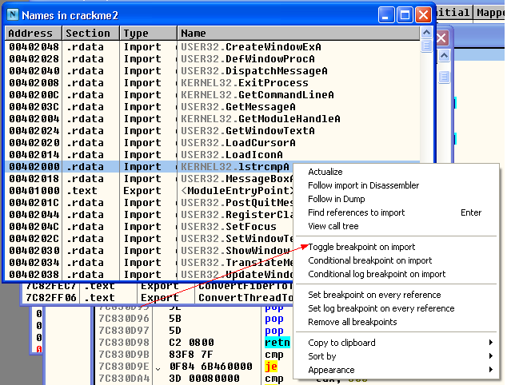
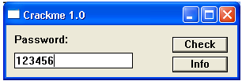
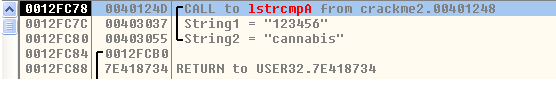
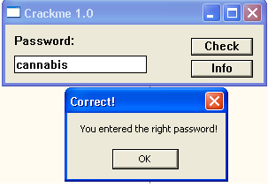

Set a API breakpoint at lstrcmpA:

press F9 to continue, than input some words in textbox:

click Check button, OD stops at the first instruction of lstrcmpA, check the stack window we can see:

the string we input is compared with "cannabis", this seems to be the right one, let's have a try. Restart program and input "cannabis", than we got the right answer:

