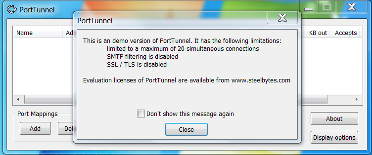

## 某端口转发软件的逆向分析笔记
### 软件介绍
**PortTunnel**是一个TCP/IP的port redirector /端口映射软件，在未注册的情况下，最多同时只能转发20个连接，功能有很大限制，使用不便，尝试对其进行逆向，研究该软件的加密原理。

### 调试
首先用**ExeinfoPe**查一下壳：

似乎是加了壳。。而且不是常见的壳类型，不管了，直接上OD:


果然加了壳，按F9运行起来，程序直接退出了：


看来做了反调试，我们使用HideOD这款反反调试插件，把所有选项都勾上，点击ok：


然后重新加载程序，按F9运行起来，这回一切顺利，弹出了主界面：


接下来，先对其脱壳。

尝试寻找一下pushad指令，F7单步跟踪了一下，没有找到。。。

按ALT+M看看程序的区段加载情况：


真正的代码段应该在401000开始的位置，我们来看一下代码段的内容：


都是0，这是因为壳还没有执行完毕，代码还没释放，我们在text段设置内存执行断点（用patch过的OD），这样程序跳转到代码段执行的时候就可以断下来：


然而事与愿违，程序没有中断而是直接运行了起来，看来作者为了防止我们调试下了很多功夫啊，内存断点也不奏效了。。没关系，我们还有办法，试试一些程序入口处常用的API函数吧，这里我选择GetCommandLineA，在函数入口处下断点（bp GetCommandLineA）,运行起来，果然断了下来，查看堆栈窗口:


调用来自42e9a4，看看这个地址的代码，OD没有将地址内容正确识别为指令，按Ctrl-Alt-A重新分析一下就可以了：


往上回溯，找到这块代码的开头：


看看是谁调用了42e8ef这块代码，在42e8ef这行按Ctrl-R:


调用来自42ea61:


同样,看看谁调用了42ea5c:


一个来自代码段之外的长跳转，看看55F119附近的代码：


前面还有一个POPAD！看来入口点是42ea5c没错了，在42ea5c处设置硬件执行断点，重新运行程序停在42ea5c处，使用OllyDump插件将程序dump下来，保存为dump.exe不要勾选Rebuid Import（因为我试了，没用。。）：


如果这时你去运行刚刚dump下来的文件dump.exe，你会发现哇居然可以运行，是不是已经脱壳成功了？！显然不是，这只是因为IAT中的函数地址也被dump了出来，因为系统环境没变，所以才能运行，如果换个系统或者重启一下电脑，你就发现它崩溃了：


So，我们需要手动修复导入表，先找找导入表在哪，在代码窗口中右键选择Search for -> All Intermodular calls:


可以看到很多对API的间接调用：


很明显，IAT就在4F5000这一区段，在数据窗口中查看，右键选择long->address:


IAT就在这里没错了，我们打开Import REC,选择porttunnel进程，填好OEP，IAT起始地址和长度，点击Get Import：


在Imported Functions Found 窗口中有valid:NO的部分，点击右侧show invalid,会把无效项都找出来，然后在无效项上右键，选择Cut thunk:


把无效项删除，这下所有都是valid:YES了，舒服，点击Fix Dump,选取我们前面dump出来的文件：


就会生成IAT修复后的文件dumped_exe：


迫不及待地双击dump_.exe运行：


我*！还不如不要修复呢，现在直接就崩了，点click here看看详细信息：

​	

怎么会访问0地址呢？看来是IAT没有完全修复，我们回到Import REC中看看刚刚显示无效的项：


Ptr指向的不是库函数，而是模块自身的函数，在OD里看看55f1b5是个啥：


一些地址无关代码，eax指向551ba, 然后间接call，看看eax-94存的是啥：


貌似一些地址，在数据窗口中查看：


我*！这居然还有一些漏网之鱼，看来刚才直接把无效项Cut掉还是太年轻了，在操作系统填充好IAT之后，我们要把模块自身的函数指针恢复，以上三个函数的地址也要恢复正确，因此我们先要把它们手动添加加到IAT表的后面，需要注意的IAT表后面的数据也是有用的，在获取地址之后也要恢复原先内容：


修改后，再用Import RCE进行IAT修复，不要忘了现在IAT的长度增加了0x10,其余操作和上面一致，文件为dump_.exe.

好了，现在我们用OD打开新的dump_.exe, 找个空余位置写一段补丁代码，我选在了BC2D0这个RVA处：

```
004BC2D0 > E8 00000000      CALL ODDMP_OE.004BC2D5
004BC2D5   58               POP EAX        ; Get current address
004BC2D6   8BD8             MOV EBX,EAX	
004BC2D8   81C3 EF8E0300    ADD EBX,38EEF               ;无效IAT项地址
004BC2DE   8BC8             MOV ECX,EAX
004BC2E0   81C1 E02E0A00    ADD ECX,0A2EE0				;模块内函数地址
004BC2E6   890B             MOV DWORD PTR DS:[EBX],ECX  ;还原无效IAT
004BC2E8   8BD8             MOV EBX,EAX
004BC2EA   81C3 FF8E0300    ADD EBX,38EFF
004BC2F0   8BC8             MOV ECX,EAX
004BC2F2   81C1 032F0A00    ADD ECX,0A2F03
004BC2F8   890B             MOV DWORD PTR DS:[EBX],ECX
004BC2FA   8BD8             MOV EBX,EAX
004BC2FC   81C3 378F0300    ADD EBX,38F37
004BC302   8BC8             MOV ECX,EAX
004BC304   81C1 912E0A00    ADD ECX,0A2E91
004BC30A   890B             MOV DWORD PTR DS:[EBX],ECX
004BC30C   8BD8             MOV EBX,EAX
004BC30E   81C3 3B8F0300    ADD EBX,38F3B
004BC314   8BC8             MOV ECX,EAX
004BC316   81C1 872E0A00    ADD ECX,0A2E87
004BC31C   890B             MOV DWORD PTR DS:[EBX],ECX
004BC31E   8BD8             MOV EBX,EAX
004BC320   81C3 478F0300    ADD EBX,38F47
004BC326   8BC8             MOV ECX,EAX
004BC328   81C1 802E0A00    ADD ECX,0A2E80
004BC32E   890B             MOV DWORD PTR DS:[EBX],ECX
004BC330   8BD8             MOV EBX,EAX
004BC332   81C3 538F0300    ADD EBX,38F53
004BC338   8BC8             MOV ECX,EAX
004BC33A   81C1 802E0A00    ADD ECX,0A2E80
004BC340   890B             MOV DWORD PTR DS:[EBX],ECX
004BC342   8BD8             MOV EBX,EAX
004BC344   81C3 578F0300    ADD EBX,38F57
004BC34A   8BC8             MOV ECX,EAX
004BC34C   81C1 1D2F0A00    ADD ECX,0A2F1D
004BC352   890B             MOV DWORD PTR DS:[EBX],ECX
004BC354   8BD8             MOV EBX,EAX
004BC356   81C3 492E0A00    ADD EBX,0A2E49				;漏网之鱼地址
004BC35C   8BC8             MOV ECX,EAX
004BC35E   81C1 B3910300    ADD ECX,391B3				;对应IAT地址
004BC364   8B11             MOV EDX,DWORD PTR DS:[ECX]	;取得函数地址
004BC366   8913             MOV DWORD PTR DS:[EBX],EDX	;更正漏网之鱼地址
004BC368   C701 00000000    MOV DWORD PTR DS:[ECX],0	;还原地址内容
004BC36E   83C3 04          ADD EBX,4
004BC371   83C1 04          ADD ECX,4
004BC374   8B11             MOV EDX,DWORD PTR DS:[ECX]
004BC376   8913             MOV DWORD PTR DS:[EBX],EDX
004BC378   C701 CD454F00    MOV DWORD PTR DS:[ECX],ODDMP_OE.004F45CD
004BC37E   83C3 04          ADD EBX,4
004BC381   83C1 04          ADD ECX,4
004BC384   8B11             MOV EDX,DWORD PTR DS:[ECX]
004BC386   8913             MOV DWORD PTR DS:[EBX],EDX
004BC388   C701 A07F4600    MOV DWORD PTR DS:[ECX],ODDMP_OE.00467FA0
004BC38E   2D 79D80800      SUB EAX,8D879
004BC393   FFE0             JMP EAX   ;跳转到真实入口点RVA:2ea5c


```

OK,保存为dump_2.exe, 别忘了再用petools修改入口点为RVA: BC2D0:


忐忑地双击dump_2.exe, YES！，弹出了正常界面，终于成功了：


现在来试试win7下如何：


我* 什么情况，怎么又崩溃了！看看问题详情，在入口点处发生了内存访问违规。。看来我还是太年轻，win7权限控制比较多，我们再用petools修改PE文件，给.text段和.exever段加上执行权限：


这回总可以了吧！，再次尝试运行


又崩了，炸裂！这回在33171发生了违规访问，在Win7下加载程序，看看33171处是啥代码：


Win7下程序开启了PIE，基地址不是400000，读取5398B7C肯定会出错。。。，很明显壳会对地址进行重定位，现在没有壳了，我们把PIE关闭即可。再次打开PETOOLS（真是神器），点击File Header ->characteristics属性，勾选Relocated stripped, 102变为了103:


再将DLL flags改为8100，PIE即可关闭：


现在！ 再来运行一下：



成功了！！ 壳终于脱完了。

### 总结

待总结